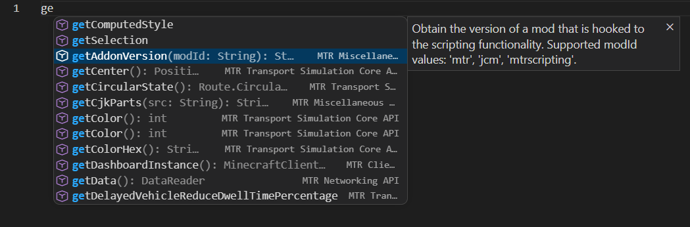
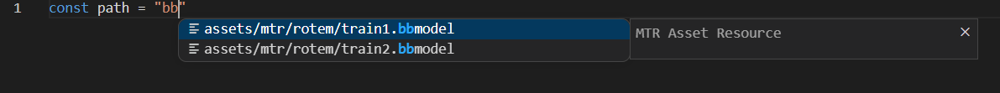

# MTR Scripting Tools

**MTR Scripting Tools** is a Visual Studio Code extension designed to enhance the development experience for Minecraft Transit Railway (MTR) mod scripting. It provides intelligent code assistance by dynamically loading API definitions to support JavaScript-based MTR scripts.

---

## Features

### 1. Dynamic IntelliSense & Code Completion
Provides complete code completion for all MTR APIs. [API Document](https://jcm.joban.org/v2.2/dev/scripting)

### 2. Asset Path Intellisense
The plugin automatically recognizes resource files in the current working directory.
Multiple format support: Supports common MTR resource formats such as .png, .obj/.bbmodel, .ogg, and .json.

---

## Todo List

- [x] **Code Completion**
- [x] **Asset Path Auto-completion**
- [ ] **In-game Hot Reload**

---

## Development

To set up the project for local development:
1.  Ensure you have **Yarn** installed.
2.  Install dependencies: `yarn install`.
3.  Compile the extension: `yarn run compile`.
4.  Press `F5` in VS Code to launch a new window with the extension loaded for testing.